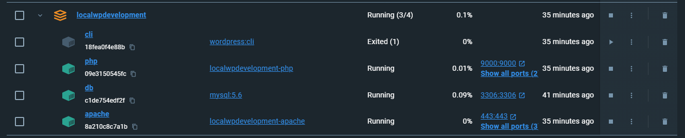

# localwpdevelopment

may rename this whole project to General DAMP Stack since its purpose is to allow a user the chance to run Apache, Mysql, PHP stacks in such a way that they can host in public_html and use .htaccess and run multiple php stacks in different ports

We have included an additional XDebug option that will work with VSCode ( and presumably PHPStorm ) so the php process runs in the containers separate to apache as well.

## Configuration

## Starting the containers ( we are assuming some level of Docker proficiency); these commands are usually running in WSL ( Windows System Linux ) but we also run this on Chromebooks and Linux distros

If you have amended, edited or added to the Apache/Vhost folder ***you will need to rebuild the image for the container***
```docker-compose up build -d # runs in detached mode```

Otherwise you can run the following and if the images do not exist then Docker handles the build and launches the containers

```sh
docker-compose up -d # runs in detached mode
```

### or

```sh
docker-compose up  # keeps the terminal active and exits when command line is closed
```

## WP CLI tool

The CLI Image tool for wordpress is included as an image that can be called and connected to your network  when run it launches an interactive terminal that has access to  public_html ; remember though in the images/containers the locamount for public_html is /var/www/html
running commands in there essentially allows you access to command line tool for wordpress.

To run WP CLI tool

```sh
docker-compose run --rm cli bash
```

then

```sh
wp core download <--- download current core Wp release
```

### Apache

If you have any other server running using the default ports of
80 and 443 you will need to comment out or change to port number of them, or the container will not be able to run.

The following configuration just exposes port 3000 so it can be reached at:
[http://localhost:3000/](http://localhost:3000/)

```yml
ports:
      # - "80:8080" 
      - "3000:8080"
      # - "443:443"
```

There are a some ports that you cannot use, so [use this page](https://www.browserstack.com/question/39572) as a reference if needed.


If you have another container in docker called ***db*** you might need to change the name and references to it, or it may not run.

## Your content

Add your content to the ***./public_html folder***

#### Your content

Add your content to the __./public_html folder__
___

## Starting the containers

### ! Important

The first time you run your docker stack you will need to make sure all the docker files have been rebuilt, if this step is not done, you will find your debug (xdebug) is probably not working.

```sh
docker compose up --build -d
```

After the initial install you can restart the stack using the following.

```sh
docker compose up -d # runs in detached mode 
# or
docker compose up  # keeps the terminal active and exits when command line is closed
```

You should now have the following in your Docker Desktop environment.



## WP CLI tool

To run WP CLI tool

```sh
docker compose run --rm cli bash
```

then

```sh
wp core download # download current core Wp release
```
